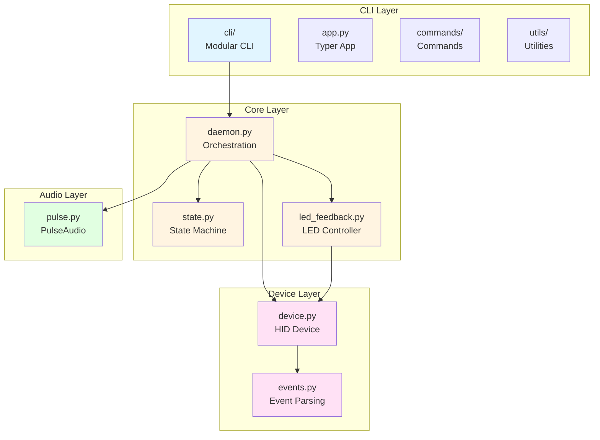
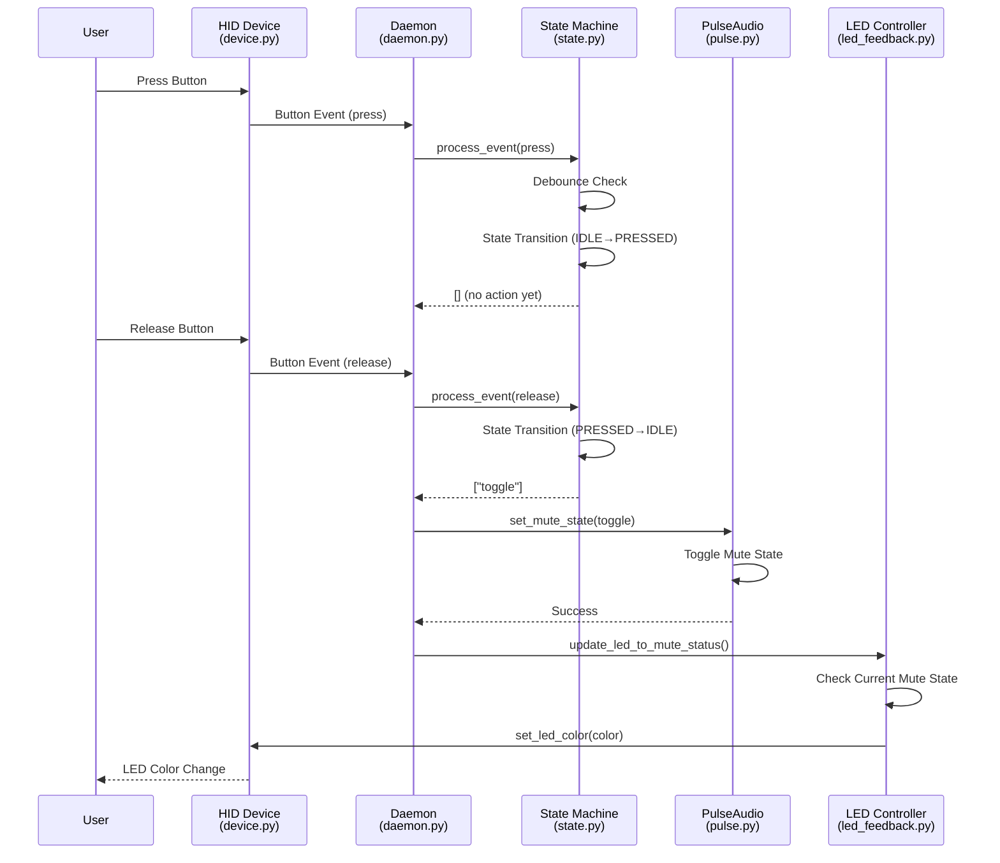
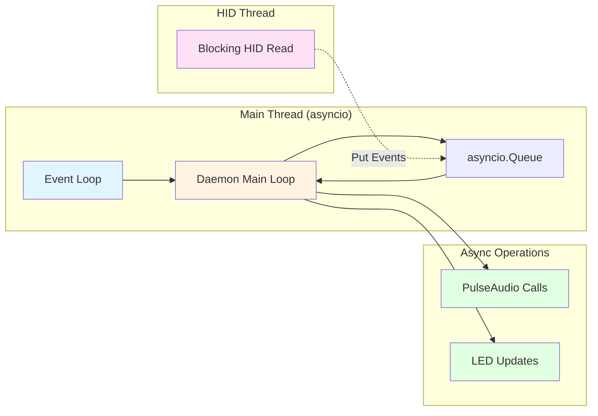

# Architecture

This document describes the architecture, project structure, and design decisions for MuteMe Button Control.

## Project Structure

```text
muteme-btn-control/
├── src/muteme_btn/          # Main application code
│   ├── __init__.py
│   ├── cli/                 # CLI interface (modularized)
│   │   ├── __init__.py      # Exports app
│   │   ├── app.py           # Main Typer app instance
│   │   ├── commands/        # Command modules
│   │   │   ├── __init__.py
│   │   │   ├── check_device.py  # check-device command
│   │   │   ├── run.py           # run command
│   │   │   ├── test_device.py  # test-device command
│   │   │   └── version.py      # version command
│   │   └── utils/           # CLI utilities
│   │       ├── __init__.py
│   │       ├── config_loader.py  # Configuration loading
│   │       └── device_helpers.py # Device discovery helpers
│   ├── config.py           # Configuration models
│   ├── main.py             # Entry point
│   ├── hid/                # HID device communication
│   │   ├── __init__.py
│   │   ├── device.py       # Device discovery and LED control
│   │   └── events.py       # Button event handling
│   ├── audio/              # Audio backend
│   │   ├── __init__.py
│   │   └── pulse.py        # PulseAudio backend implementation
│   ├── core/               # Core logic
│   │   ├── __init__.py
│   │   ├── daemon.py       # Main daemon orchestration
│   │   ├── state.py        # Button state machine
│   │   └── led_feedback.py # LED feedback controller
│   └── utils/              # Utilities
│       ├── __init__.py
│       └── logging.py      # Structured logging
├── tests/                  # Test suite
├── config/                 # Configuration files
│   ├── muteme.toml.example # Example configuration
│   └── udev/               # UDEV rules
├── docs/                   # Documentation
│   ├── specs/              # Feature specifications
│   └── reference/         # Reference documentation
├── justfile                # Task runner recipes
└── pyproject.toml          # Project configuration
```

## Technology Stack

- **CLI Framework**: Typer (modern, type-hint friendly)
- **HID Communication**: `hidapi` Python bindings
- **Audio Control**: `pulsectl` for PulseAudio
- **Configuration**: TOML with `pydantic` for validation
- **Concurrency**: `asyncio` with thread-based HID I/O
- **Logging**: `structlog` for structured, human-readable text logs
- **Testing**: `pytest` with async support
- **Dependency Management**: `uv` for fast, reliable package management
- **Task Runner**: `just` for development workflows

## Architecture Overview

The application follows a layered architecture with clear separation of concerns:



1. **CLI Layer** (`cli/`): Modular user interface with command modules and shared utilities
2. **Core Layer** (`core/`): Business logic, state management, and orchestration
3. **Device Layer** (`hid/`): Hardware communication and device abstraction
4. **Audio Layer** (`audio/`): Audio backend abstraction and PulseAudio implementation
5. **Utilities** (`utils/`): Shared utilities like logging

## Module Organization Principles

### Single Responsibility

Each module should have one clear purpose:

- `hid/device.py`: Device discovery and LED control
- `hid/events.py`: Button event parsing
- `core/state.py`: Button state machine logic
- `core/daemon.py`: Application orchestration
- `audio/pulse.py`: PulseAudio-specific implementation

### Separation of Concerns

- **HID layer**: Handles all USB device communication
- **Audio layer**: Abstracts audio backend operations
- **Core layer**: Contains business logic independent of specific implementations
- **CLI layer**: User interface only, delegates to core layer

### Dependency Direction

- Core logic should not depend on CLI or specific implementations
- Use abstract base classes for backends (e.g., audio backends)
- Dependencies flow inward: CLI → Core → Device/Audio

### Interface Design

- Use abstract base classes for extensible backends (audio, etc.)
- Keep interfaces minimal and focused
- Prefer composition over inheritance

## File Size Guidelines

- **Maximum Size**: Aim for <300 lines per file
- **Large Files**: Split into smaller modules when exceeding limits
- **CLI Commands**: Each command is in its own module under `cli/commands/`

## Button Press Event Flow

The following diagram shows how a button press flows through the system:



Key points:

1. Button events are read from HID device (blocking thread)
2. Events are processed through state machine (debouncing, state transitions)
3. Actions are generated by state machine (e.g., "toggle")
4. Actions trigger audio mute/unmute operations
5. LED feedback is updated to reflect current mute status

### HID Layer (`hid/`)

**`device.py`**: Handles MuteMe device discovery, connection, and LED control.

- Device discovery via USB VID/PID matching
- HID report generation for LED control
- Permission checking and error handling

**`events.py`**: Parses button press/release events from HID device.

- Event type detection (touch/release)
- Event timestamping

### Audio Layer (`audio/`)

**`pulse.py`**: PulseAudio backend implementation.

- Mute/unmute operations
- Device targeting (all/default)
- State querying

### Core Layer (`core/`)

**`state.py`**: Button state machine for toggle mode.

- Event debouncing
- State transitions
- Action generation

**`daemon.py`**: Main application daemon.

- Coordinates device, audio, and state machine
- Event loop management
- Signal handling
- Startup/shutdown procedures

**`led_feedback.py`**: LED feedback controller.

- Synchronizes LED color with mute status
- Color mapping (red=muted, green=unmuted)

### CLI Layer (`cli/`)

The CLI is organized into a modular structure:

- **`app.py`**: Main Typer app instance and callback setup
- **`commands/`**: Individual command modules
  - `check_device.py`: Device status checking
  - `run.py`: Daemon execution
  - `test_device.py`: Device testing and diagnostics
  - `version.py`: Version information
- **`utils/`**: Shared CLI utilities
  - `config_loader.py`: Configuration file loading
  - `device_helpers.py`: Device discovery and connection helpers

Each command module is self-contained with its own helper functions, keeping the codebase maintainable and following single responsibility principles.

## Concurrency Model



- **Main Thread**: asyncio event loop for coordination
- **HID Thread**: Blocking reads from USB device (thread-based)
- **Audio Operations**: Async calls to PulseAudio
- **Communication**: asyncio Queues between components

## Configuration Strategy

- **Pydantic Models**: Type-safe configuration with validation
- **Multiple Sources**: CLI args → config file → defaults
- **File Locations**: `./muteme.toml`, `~/.config/muteme/muteme.toml`, `/etc/muteme/muteme.toml`

## Error Handling Philosophy

- **Graceful Degradation**: Continue operating if non-critical components fail
- **Structured Errors**: Custom exception classes with clear messages
- **Comprehensive Logging**: Every error logged with context
- **User-Friendly Messages**: Provide actionable error messages

## Design Decisions

### Why asyncio?

- Enables efficient concurrent operations (device reading, audio polling)
- Better resource utilization than threading for I/O-bound operations
- Cleaner code than callback-based approaches

### Why Thread-Based HID I/O?

- HID device reads are blocking operations
- Threading allows blocking I/O without blocking the event loop
- Simpler than async HID libraries

### Why Typer?

- Modern CLI framework with excellent type hint support
- Automatic help generation
- Clean, declarative command definitions

### Why Pydantic?

- Type-safe configuration validation
- Clear error messages for invalid configuration
- Easy integration with TOML files

## Future Architecture Considerations

- **Audio Backend Abstraction**: Abstract base class for audio backends (PipeWire support)
- **Hot-Plug Support**: Device reconnection handling
- **Runtime Configuration**: Unix socket for live configuration changes
